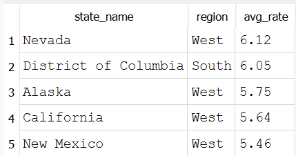
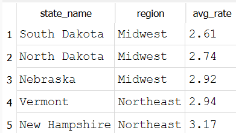

# Which states have the highest and lowest average unemployment rate since 2015?

## Highest average unemployment

## Lowest average unemployment

## Conclusion
Nevada's average unemployment rate (6.12%) is more than double South Dakota's (2.61%) over the same 11-year window, which is a striking gap for states operating in the same national economy. This shows that the issue isn't regional, rather it is likely multi-facated.