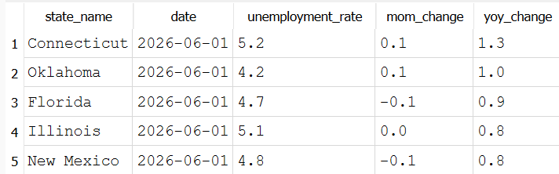

# What's the month-over-month and year-over-year change in unemployment rate by state?

## Conclusion
For June 2026, Connecticut posted the sharpest year-over-year deterioration (+1.3), followed by Oklahoma (+1.0), Florida (+0.9), Illinois (+0.8), and New Mexico (+0.8). None of which appeared in the earlier "highest average" list, showing that this result catches something a regular average misses.