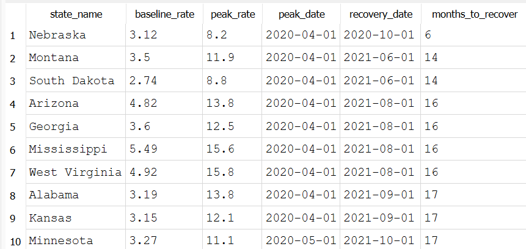

# Which states recovered fastest from the 2020 COVID unemployment spike?

## Conclusion
Nebraska's recovery (6 months) was more than twice as fast as the next-fastest states.Its pre-COVID baseline was low and its labor market snapped back quickly. Something worth noting: only 45 of 51 states/DC have recovered to their 2019 baseline at all as of the most recent data (June 2026), 6 states have not yet gotten back to pre-pandemic levels even six years later