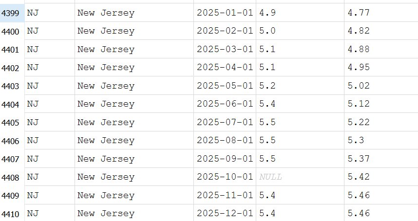
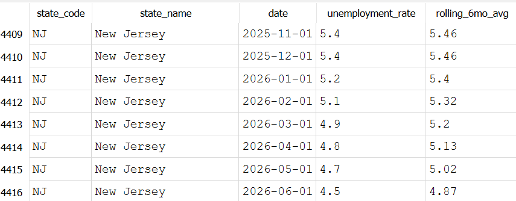

# What's the rolling 6-month average unemployment rate by state?

## Conclusion
New Jersey's 6-month rolling average didn't move in one direction over this window. It rose steadily from 4.77% in January 2025 to a peak of 5.46% around November/December 2025, then reversed and declined down to 4.87% by June 2026. A regular year over year comparison would miss or flatten out. This is why it is always good to look at data from mutiple angles, to help get a better picture of what information the data is telling.