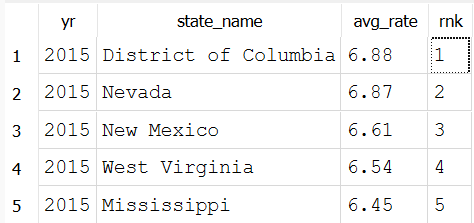

# Which states ranked in the top 5 for unemployment in each calendar year?

## Conclusion
What stands out more than the shift itself is which state didn't leave the list. California and Nevada rank in the top 5 in both 2020 and 2025, despite the overall level dropping by more than half (Nevada's top rate fell from 13.67 to 5.25). That persistence suggests their elevated unemployment isn't only related to COVID, it points to something more structural about those two labor markets that outlasted the shock that first put them at the top. 