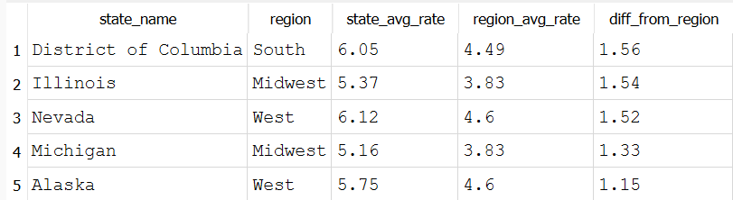

# How does each state's average unemployment compare to its region's average?

## Conclusion
Illinois and Michigan stand out here specifically because they're the outliers *within* an otherwise low-unemployment region (the Midwest), over a point and a half above their regional peers. A region-level view alone would have hidden this; joining state data to regional aggregates is what surfaces states that don't fit their neighborhood's story.